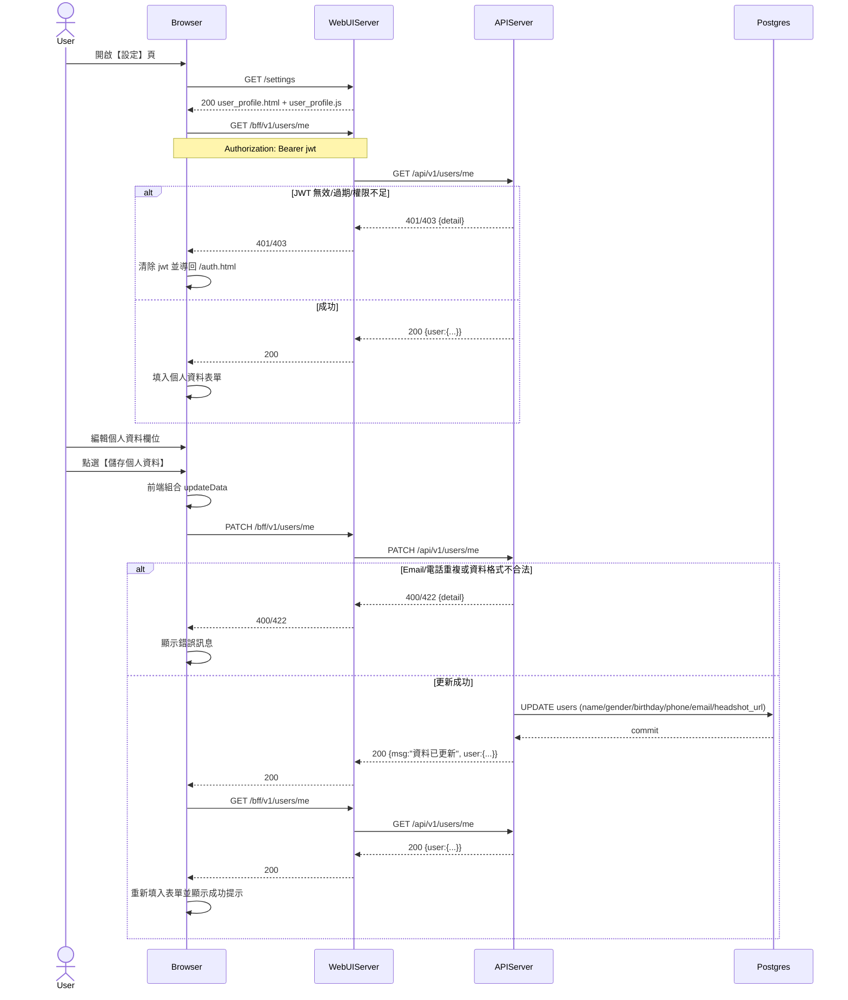

# 2-6-1 使用者設定

# Mermaid

## Mermaid 備註
- 前端：`ApiClient.getCurrentUser()` → `GET /bff/v1/users/me`；`ApiClient.updateUserProfile()` → `PATCH /bff/v1/users/me`（參考 `services/WebUIServer/app/static/js/APIClient.js`）。
- 後端：`PATCH /api/v1/users/me` 會檢查 `email` 唯一性，並更新 `users` 資料表。
