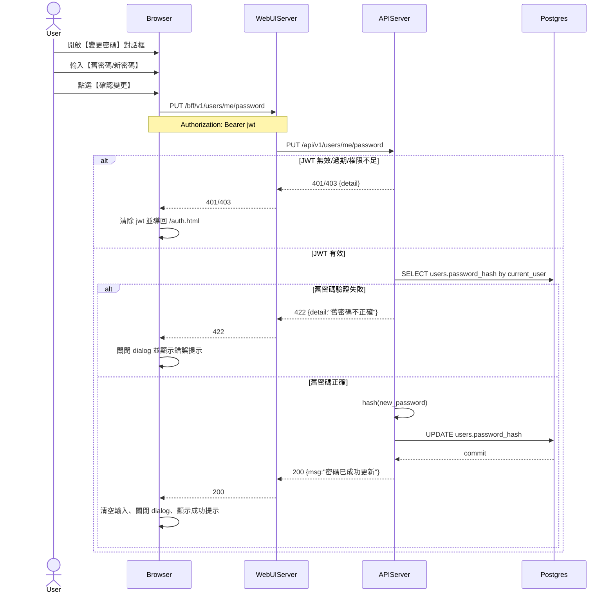

# 2-6-2 變更密碼

# Mermaid

## Mermaid 備註
- 前端：`ApiClient.changePassword()` → `PUT /bff/v1/users/me/password`（body: `{old_password,new_password}`）。
- 後端：`PUT /api/v1/users/me/password` 會先 `verify_password(old_password)`，成功才更新 `users.password_hash`。
- `user_profile.html` 的 input pattern 限制為 6 位數字，但 `user_profile.js` 已註記「不再做格式驗證，交由後端檢查」。
