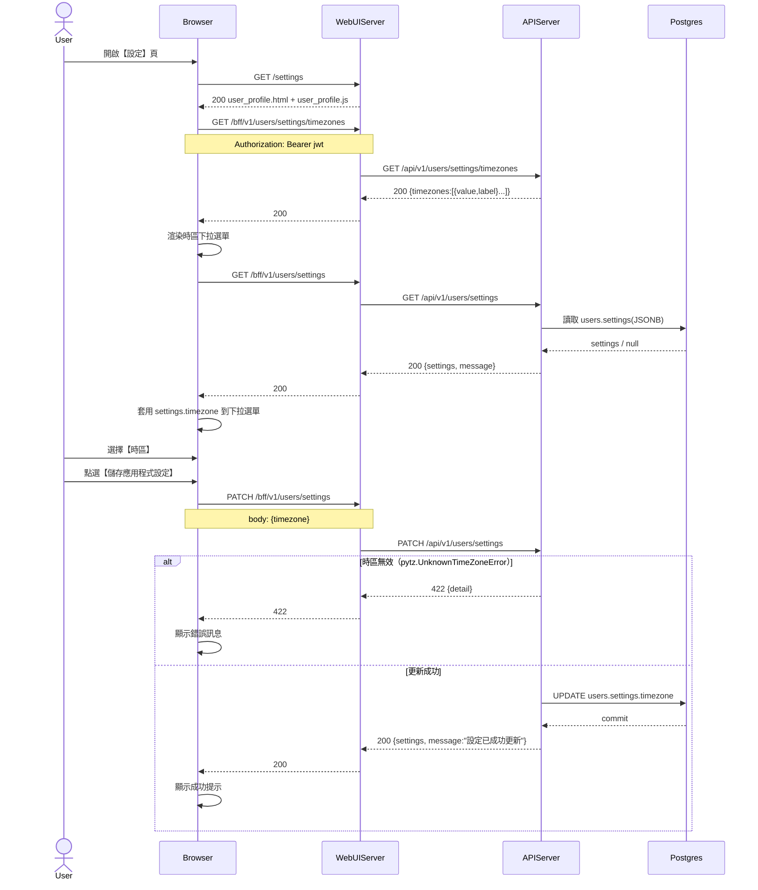

# 2-6-3 時區設定

# Mermaid

```mermaid
sequenceDiagram
  actor User
  participant Browser
  participant WebUIServer
  participant APIServer
  participant Postgres

  User ->> Browser: 開啟【設定】頁
  Browser ->> WebUIServer: GET /settings
  WebUIServer -->> Browser: 200 user_profile.html + user_profile.js

  Browser ->> WebUIServer: GET /bff/v1/users/settings/timezones
  Note over Browser,WebUIServer: Authorization: Bearer jwt
  WebUIServer ->> APIServer: GET /api/v1/users/settings/timezones
  APIServer -->> WebUIServer: 200 {timezones:[{value,label}...]}
  WebUIServer -->> Browser: 200
  Browser ->> Browser: 渲染時區下拉選單

  Browser ->> WebUIServer: GET /bff/v1/users/settings
  WebUIServer ->> APIServer: GET /api/v1/users/settings
  APIServer ->> Postgres: 讀取 users.settings(JSONB)
  Postgres -->> APIServer: settings / null
  APIServer -->> WebUIServer: 200 {settings, message}
  WebUIServer -->> Browser: 200
  Browser ->> Browser: 套用 settings.timezone 到下拉選單

  User ->> Browser: 選擇【時區】
  User ->> Browser: 點選【儲存應用程式設定】
  Browser ->> WebUIServer: PATCH /bff/v1/users/settings
  Note over Browser,WebUIServer: body: {timezone}
  WebUIServer ->> APIServer: PATCH /api/v1/users/settings

  alt 時區無效（pytz.UnknownTimeZoneError）
    APIServer -->> WebUIServer: 422 {detail}
    WebUIServer -->> Browser: 422
    Browser ->> Browser: 顯示錯誤訊息
  else 更新成功
    APIServer ->> Postgres: UPDATE users.settings.timezone
    Postgres -->> APIServer: commit
    APIServer -->> WebUIServer: 200 {settings, message:"設定已成功更新"}
    WebUIServer -->> Browser: 200
    Browser ->> Browser: 顯示成功提示
  end
```

## Mermaid 備註
- API：`GET /bff/v1/users/settings/timezones`、`GET/PATCH /bff/v1/users/settings`。
- 後端時區驗證：`UserSettings.timezone` 透過 `pytz.timezone()` 驗證，不合法會回 422。
