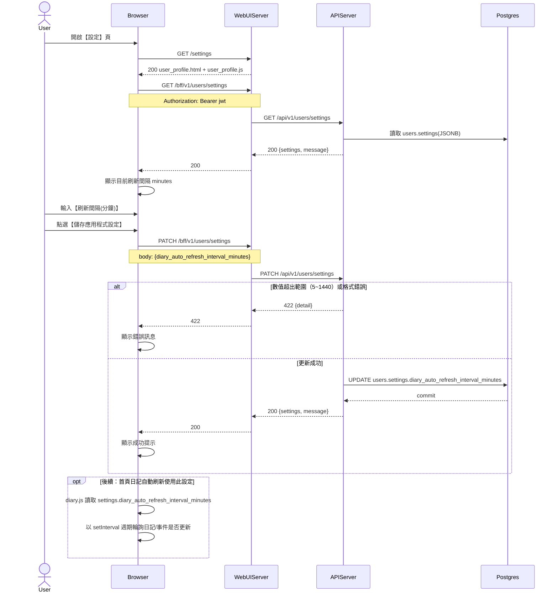

# 2-6-4 日記自動刷新設定

# Mermaid

```mermaid
sequenceDiagram
  actor User
  participant Browser
  participant WebUIServer
  participant APIServer
  participant Postgres

  User ->> Browser: 開啟【設定】頁
  Browser ->> WebUIServer: GET /settings
  WebUIServer -->> Browser: 200 user_profile.html + user_profile.js

  Browser ->> WebUIServer: GET /bff/v1/users/settings
  Note over Browser,WebUIServer: Authorization: Bearer jwt
  WebUIServer ->> APIServer: GET /api/v1/users/settings
  APIServer ->> Postgres: 讀取 users.settings(JSONB)
  APIServer -->> WebUIServer: 200 {settings, message}
  WebUIServer -->> Browser: 200
  Browser ->> Browser: 顯示目前刷新間隔 minutes

  User ->> Browser: 輸入【刷新間隔(分鐘)】
  User ->> Browser: 點選【儲存應用程式設定】
  Browser ->> WebUIServer: PATCH /bff/v1/users/settings
  Note over Browser,WebUIServer: body: {diary_auto_refresh_interval_minutes}
  WebUIServer ->> APIServer: PATCH /api/v1/users/settings

  alt 數值超出範圍（5~1440）或格式錯誤
    APIServer -->> WebUIServer: 422 {detail}
    WebUIServer -->> Browser: 422
    Browser ->> Browser: 顯示錯誤訊息
  else 更新成功
    APIServer ->> Postgres: UPDATE users.settings.diary_auto_refresh_interval_minutes
    Postgres -->> APIServer: commit
    APIServer -->> WebUIServer: 200 {settings, message}
    WebUIServer -->> Browser: 200
    Browser ->> Browser: 顯示成功提示
  end

  opt 後續：首頁日記自動刷新使用此設定
    Browser ->> Browser: diary.js 讀取 settings.diary_auto_refresh_interval_minutes
    Browser ->> Browser: 以 setInterval 週期輪詢日記/事件是否更新
  end
```

## Mermaid 備註
- 設定儲存：`PATCH /bff/v1/users/settings`（欄位：`diary_auto_refresh_interval_minutes`）。
- 前端實際使用：`services/WebUIServer/app/static/js/diary.js` 會讀取此設定來決定自動刷新週期。
