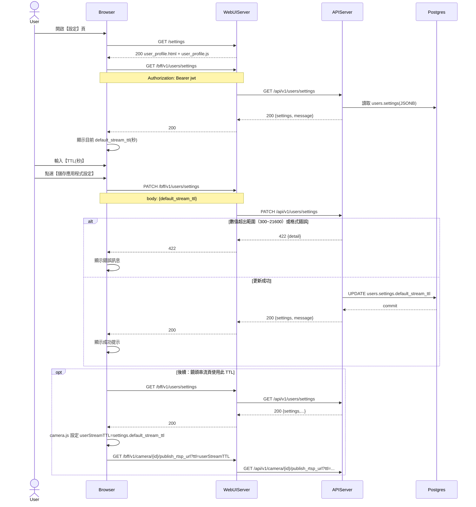

# 2-6-5 串流連結TTL 設定

# Mermaid

## Mermaid 備註
- 設定儲存：`PATCH /bff/v1/users/settings`（欄位：`default_stream_ttl`，範圍 300~21600 秒）。
- 前端實際使用：`services/WebUIServer/app/static/js/camera.js` 載入 `users/settings` 後會用 `default_stream_ttl` 作為串流相關 API 的預設 TTL。
