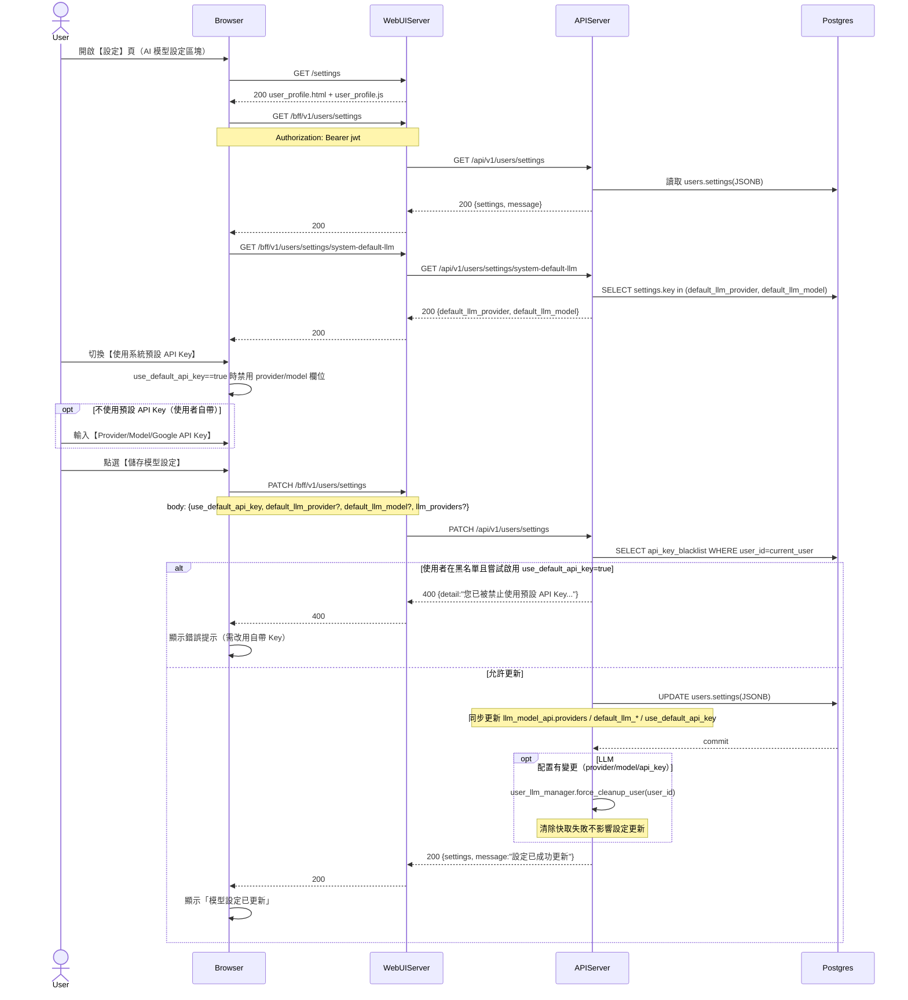

# 2-6-6 LLM 設定

# Mermaid

## Mermaid 備註
- 讀取/更新使用者設定：`GET/PATCH /bff/v1/users/settings`。
- 顯示系統預設 LLM：`GET /bff/v1/users/settings/system-default-llm`（讀 `settings` 表）。
- 黑名單限制：`PATCH /api/v1/users/settings` 在 `use_default_api_key=true` 時會檢查 `api_key_blacklist`，若在黑名單則回 400。
- 模型快取清理：當 `default_llm_provider/default_llm_model/llm_providers` 變更時，後端會呼叫 `user_llm_manager.force_cleanup_user()`（in-memory）。
