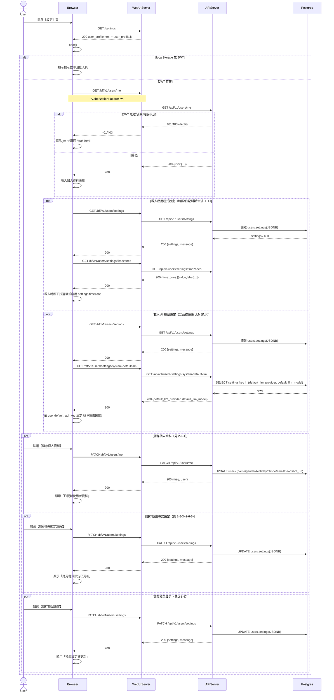

# 2-6 使用者設定

# Mermaid

## Mermaid 備註
- 設定頁面：`GET /settings`（WebUIServer 回傳 `user_profile.html` + `user_profile.js`）。
- 使用者資料：`GET/PATCH /bff/v1/users/me` → `GET/PATCH /api/v1/users/me`。
- 使用者設定：`GET/PATCH /bff/v1/users/settings` → `GET/PATCH /api/v1/users/settings`（存放於 `users.settings` JSONB）。
- 時區清單：`GET /bff/v1/users/settings/timezones`。
- 系統預設 LLM：`GET /bff/v1/users/settings/system-default-llm`（讀 `settings` 表的 `default_llm_provider/default_llm_model`）。
