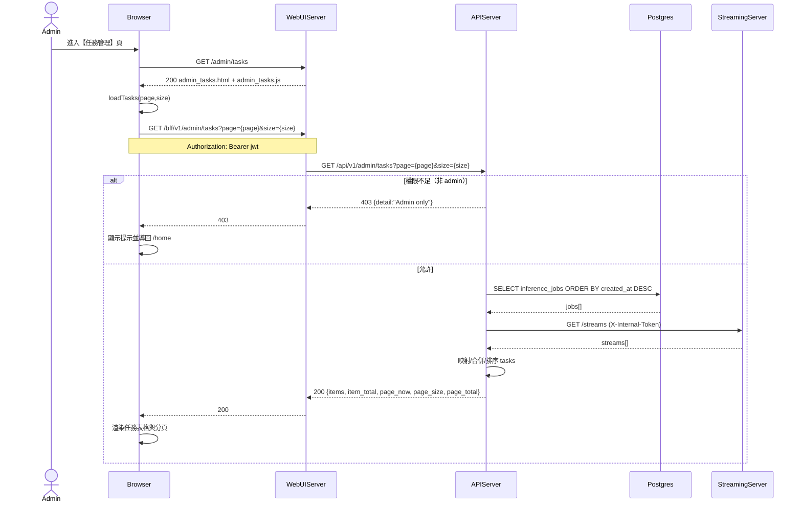

# 3-1-1 任務列表

# Mermaid

```mermaid
sequenceDiagram
  actor Admin
  participant Browser
  participant WebUIServer
  participant APIServer
  participant Postgres
  participant StreamingServer

  Admin ->> Browser: 進入【任務管理】頁
  Browser ->> WebUIServer: GET /admin/tasks
  WebUIServer -->> Browser: 200 admin_tasks.html + admin_tasks.js

  Browser ->> Browser: loadTasks(page,size)
  Browser ->> WebUIServer: GET /bff/v1/admin/tasks?page={page}&size={size}
  Note over Browser,WebUIServer: Authorization: Bearer jwt
  WebUIServer ->> APIServer: GET /api/v1/admin/tasks?page={page}&size={size}

  alt 權限不足（非 admin）
    APIServer -->> WebUIServer: 403 {detail:"Admin only"}
    WebUIServer -->> Browser: 403
    Browser ->> Browser: 顯示提示並導回 /home
  else 允許
    APIServer ->> Postgres: SELECT inference_jobs ORDER BY created_at DESC
    Postgres -->> APIServer: jobs[]
    APIServer ->> StreamingServer: GET /streams (X-Internal-Token)
    StreamingServer -->> APIServer: streams[]
    APIServer ->> APIServer: 映射/合併/排序 tasks
    APIServer -->> WebUIServer: 200 {items, item_total, page_now, page_size, page_total}
    WebUIServer -->> Browser: 200
    Browser ->> Browser: 渲染任務表格與分頁
  end
```

## Mermaid 備註
- API：`GET /bff/v1/admin/tasks`（query：`page`、`size`）。
- 後端分頁：APIServer 合併任務後在記憶體做 `tasks[start:end]`（不是 DB LIMIT/OFFSET）。
