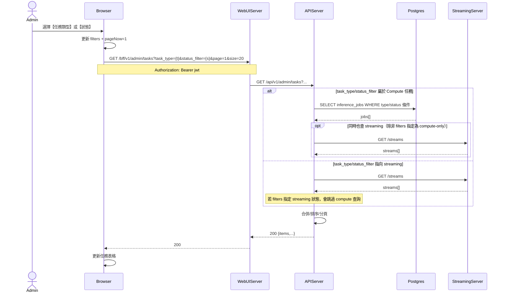

# 3-1-2 依狀態/類型篩選

# Mermaid

## Mermaid 備註
- 篩選參數：前端送 `task_type`、`status_filter`、`page`、`size`（參考 `ApiClient.admin.tasks.list()`）。
- 類型映射（Compute ↔ UI）：例如 `video_description` ↔ DB `video_description_extraction`（後端在 `/admin/tasks` 做雙向 mapping）。
