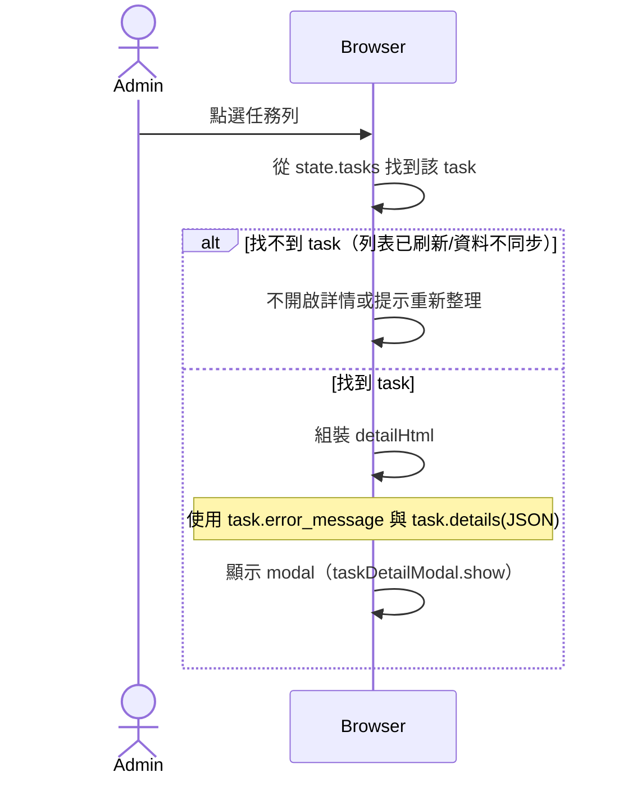

# 3-1-3 查看任務詳情

# Mermaid

```mermaid
sequenceDiagram
  actor Admin
  participant Browser

  Admin ->> Browser: 點選任務列
  Browser ->> Browser: 從 state.tasks 找到該 task

  alt 找不到 task（列表已刷新/資料不同步）
    Browser ->> Browser: 不開啟詳情或提示重新整理
  else 找到 task
    Browser ->> Browser: 組裝 detailHtml
    Note over Browser: 使用 task.error_message 與 task.details(JSON)
    Browser ->> Browser: 顯示 modal（taskDetailModal.show）
  end
```

## Mermaid 備註
- 前端不會再呼叫後端 detail API：任務詳情直接使用 `/admin/tasks` 回傳的 `items[].details`。
- Streaming 任務的 `created_at/updated_at` 可能為 `null`（StreamingServer 未提供建立時間）。
