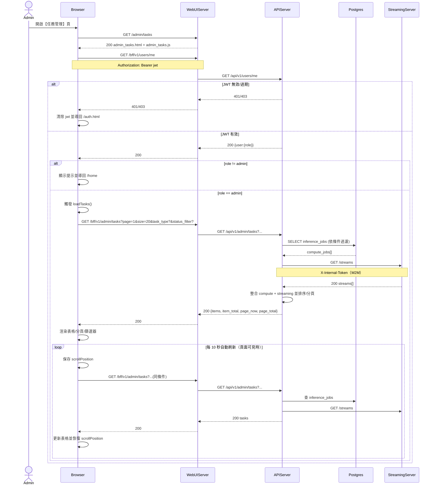

# 3-1 任務管理

# Mermaid

## Mermaid 備註
- 前端頁面：`GET /admin/tasks`（WebUIServer 回傳 `admin_tasks.html` + `admin_tasks.js`）。
- 任務列表 API：`GET /bff/v1/admin/tasks` → `GET /api/v1/admin/tasks`（僅管理員；後端 `ensure_admin()`）。
- 任務來源：
  - Compute 任務：Postgres `inference_jobs`。
  - 串流任務：`StreamingServer GET /streams`（需 `X-Internal-Token`）。
- 詳情：前端以 `items[].details` 直接顯示，不會再額外呼叫 detail API（見 3-1-3）。
