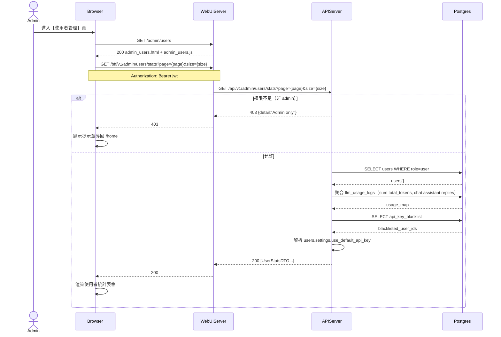

# 3-2-1 使用者統計

# Mermaid

## Mermaid 備註
- API：`GET /bff/v1/admin/users/stats`。
- 聊天訊息數：後端只統計 `llm_usage_logs.source == "chat"` 的 `assistant_replies`。
- 分頁：前端目前帶 `page/size` 參數，但後端 `GET /admin/users/stats` **未實作分頁**（回傳 list）。
