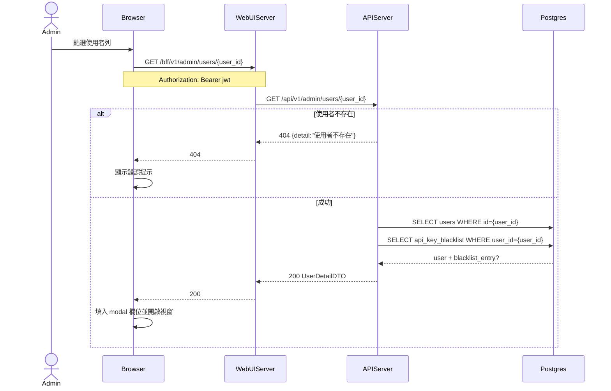

# 3-2-2 檢視單一使用者詳情

# Mermaid

```mermaid
sequenceDiagram
  actor Admin
  participant Browser
  participant WebUIServer
  participant APIServer
  participant Postgres

  Admin ->> Browser: 點選使用者列
  Browser ->> WebUIServer: GET /bff/v1/admin/users/{user_id}
  Note over Browser,WebUIServer: Authorization: Bearer jwt
  WebUIServer ->> APIServer: GET /api/v1/admin/users/{user_id}

  alt 使用者不存在
    APIServer -->> WebUIServer: 404 {detail:"使用者不存在"}
    WebUIServer -->> Browser: 404
    Browser ->> Browser: 顯示錯誤提示
  else 成功
    APIServer ->> Postgres: SELECT users WHERE id={user_id}
    APIServer ->> Postgres: SELECT api_key_blacklist WHERE user_id={user_id}
    Postgres -->> APIServer: user + blacklist_entry?
    APIServer -->> WebUIServer: 200 UserDetailDTO
    WebUIServer -->> Browser: 200
    Browser ->> Browser: 填入 modal 欄位並開啟視窗
  end
```

## Mermaid 備註
- 回傳資料包含 `password_hash`、`active`、`settings`、`is_blacklisted` 與 `blacklist_reason`。
- 前端：`fetchAndOpenUserDetail()` 會在 modal 顯示「載入中...」提示。
