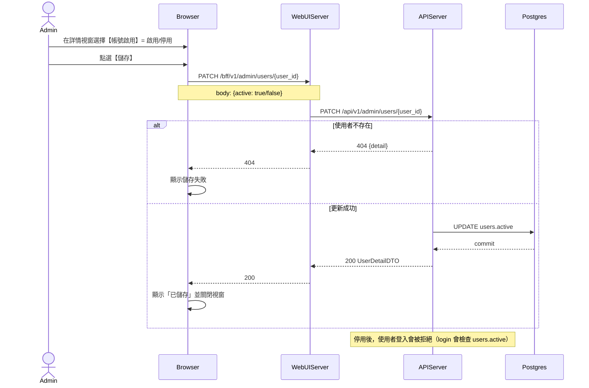

# 3-2-3 啟用/停用使用者帳號

# Mermaid

```mermaid
sequenceDiagram
  actor Admin
  participant Browser
  participant WebUIServer
  participant APIServer
  participant Postgres

  Admin ->> Browser: 在詳情視窗選擇【帳號啟用】= 啟用/停用
  Admin ->> Browser: 點選【儲存】

  Browser ->> WebUIServer: PATCH /bff/v1/admin/users/{user_id}
  Note over Browser,WebUIServer: body: {active: true/false}
  WebUIServer ->> APIServer: PATCH /api/v1/admin/users/{user_id}

  alt 使用者不存在
    APIServer -->> WebUIServer: 404 {detail}
    WebUIServer -->> Browser: 404
    Browser ->> Browser: 顯示儲存失敗
  else 更新成功
    APIServer ->> Postgres: UPDATE users.active
    Postgres -->> APIServer: commit
    APIServer -->> WebUIServer: 200 UserDetailDTO
    WebUIServer -->> Browser: 200
    Browser ->> Browser: 顯示「已儲存」並關閉視窗
  end

  Note over APIServer: 停用後，使用者登入會被拒絕（login 會檢查 users.active）
```

## Mermaid 備註
- API：`PATCH /bff/v1/admin/users/{user_id}`。
- 前端儲存流程：若 active 有變更，會先呼叫 `setActive()`，再處理黑名單變更（若有）。
