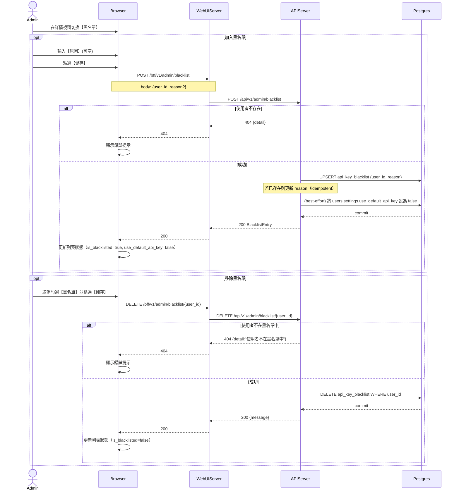

# 3-2-4 預設 API Key 黑名單管理

# Mermaid

## Mermaid 備註
- 加入/更新原因：前端一律呼叫 `POST /admin/blacklist`；後端若已存在則視為更新 reason。
- 加入黑名單會同步：嘗試把該使用者 `users.settings.use_default_api_key` 改為 `false`，避免仍使用系統預設 key。
- 黑名單的意義：被列入者在使用者設定頁無法啟用「使用系統預設 API Key」（見 2-6-6）。
