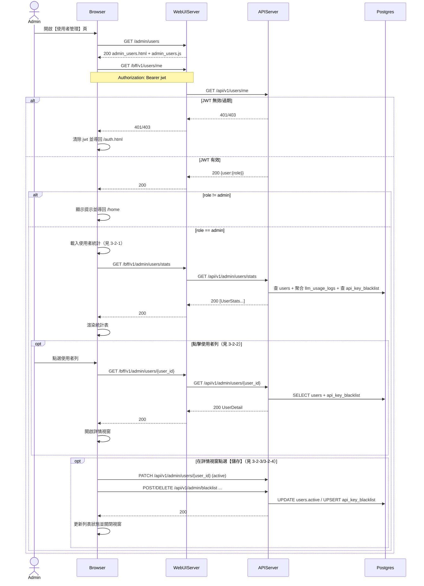

# 3-2 使用者管理

# Mermaid

## Mermaid 備註
- 使用者統計：`GET /bff/v1/admin/users/stats`（後端目前回傳 **整個列表**；前端雖帶 `page/size` 但後端未實作分頁）。
- 使用者詳情：`GET /bff/v1/admin/users/{user_id}`（包含 `password_hash`、黑名單狀態與原因）。
- 啟用/停用：`PATCH /bff/v1/admin/users/{user_id}`（body: `{active}`）。
- 黑名單：`POST /bff/v1/admin/blacklist`、`DELETE /bff/v1/admin/blacklist/{user_id}`（加入時會同步把 `users.settings.use_default_api_key=false`）。
