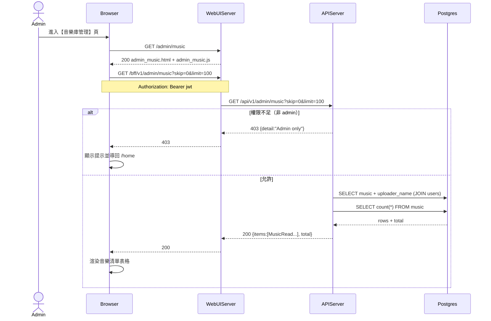

# 3-3-1 音樂清單

# Mermaid

```mermaid
sequenceDiagram
  actor Admin
  participant Browser
  participant WebUIServer
  participant APIServer
  participant Postgres

  Admin ->> Browser: 進入【音樂庫管理】頁
  Browser ->> WebUIServer: GET /admin/music
  WebUIServer -->> Browser: 200 admin_music.html + admin_music.js

  Browser ->> WebUIServer: GET /bff/v1/admin/music?skip=0&limit=100
  Note over Browser,WebUIServer: Authorization: Bearer jwt
  WebUIServer ->> APIServer: GET /api/v1/admin/music?skip=0&limit=100

  alt 權限不足（非 admin）
    APIServer -->> WebUIServer: 403 {detail:"Admin only"}
    WebUIServer -->> Browser: 403
    Browser ->> Browser: 顯示提示並導回 /home
  else 允許
    APIServer ->> Postgres: SELECT music + uploader_name (JOIN users)
    APIServer ->> Postgres: SELECT count(*) FROM music
    Postgres -->> APIServer: rows + total
    APIServer -->> WebUIServer: 200 {items:[MusicRead...], total}
    WebUIServer -->> Browser: 200
    Browser ->> Browser: 渲染音樂清單表格
  end
```

## Mermaid 備註
- API：`GET /bff/v1/admin/music?skip&limit`（後端回傳 `{items,total}`）。
- 清單顯示欄位：`name/composer/duration/uploader_user_id/created_at`。
