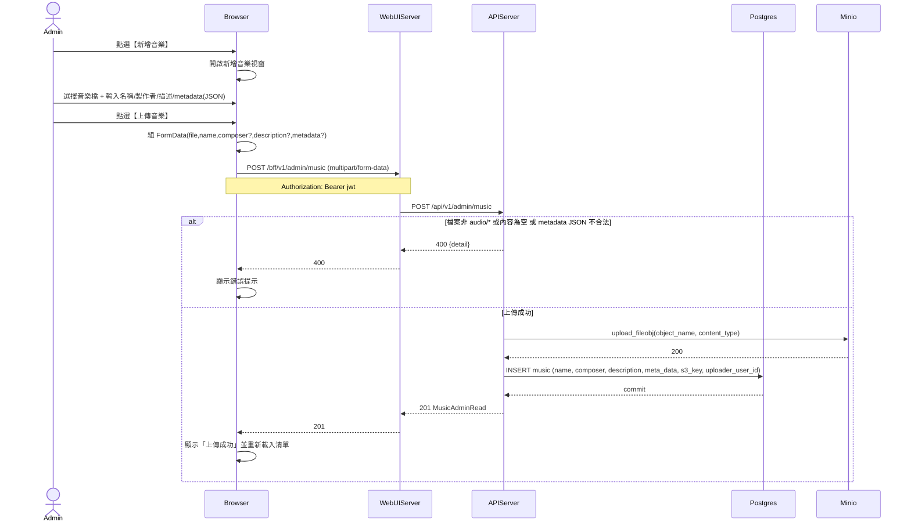

# 3-3-2 上傳音樂

# Mermaid

## Mermaid 備註
- API：`POST /bff/v1/admin/music`（`UploadFile` + `Form` 欄位）。
- 物件命名：`{admin_user_id}/music/{uuid}.{ext}`，並存入 `music.s3_key`。
- `metadata`：前端會先 `JSON.parse()` 驗證；後端也會再 `json.loads()` 驗證並合併 `original_filename/content_length`。
