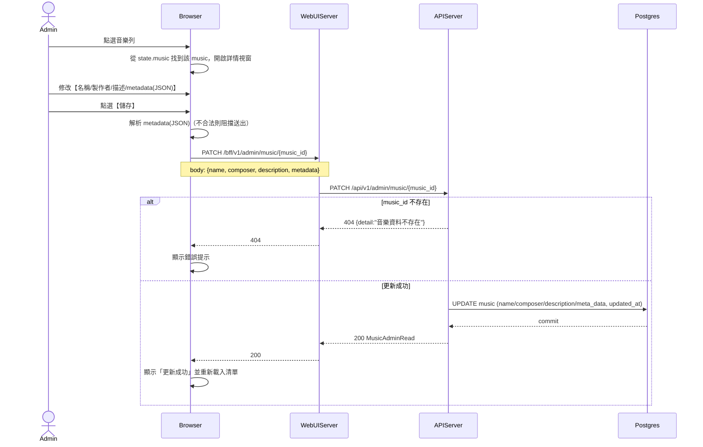

# 3-3-3 編輯音樂資訊

# Mermaid

```mermaid
sequenceDiagram
  actor Admin
  participant Browser
  participant WebUIServer
  participant APIServer
  participant Postgres

  Admin ->> Browser: 點選音樂列
  Browser ->> Browser: 從 state.music 找到該 music，開啟詳情視窗
  Admin ->> Browser: 修改【名稱/製作者/描述/metadata(JSON)】
  Admin ->> Browser: 點選【儲存】

  Browser ->> Browser: 解析 metadata(JSON)（不合法則阻擋送出）
  Browser ->> WebUIServer: PATCH /bff/v1/admin/music/{music_id}
  Note over Browser,WebUIServer: body: {name, composer, description, metadata}
  WebUIServer ->> APIServer: PATCH /api/v1/admin/music/{music_id}

  alt music_id 不存在
    APIServer -->> WebUIServer: 404 {detail:"音樂資料不存在"}
    WebUIServer -->> Browser: 404
    Browser ->> Browser: 顯示錯誤提示
  else 更新成功
    APIServer ->> Postgres: UPDATE music (name/composer/description/meta_data, updated_at)
    Postgres -->> APIServer: commit
    APIServer -->> WebUIServer: 200 MusicAdminRead
    WebUIServer -->> Browser: 200
    Browser ->> Browser: 顯示「更新成功」並重新載入清單
  end
```

## Mermaid 備註
- API：`PATCH /bff/v1/admin/music/{music_id}`。
- 後端會把 `metadata` 直接寫回 `music.meta_data`（覆寫）。
