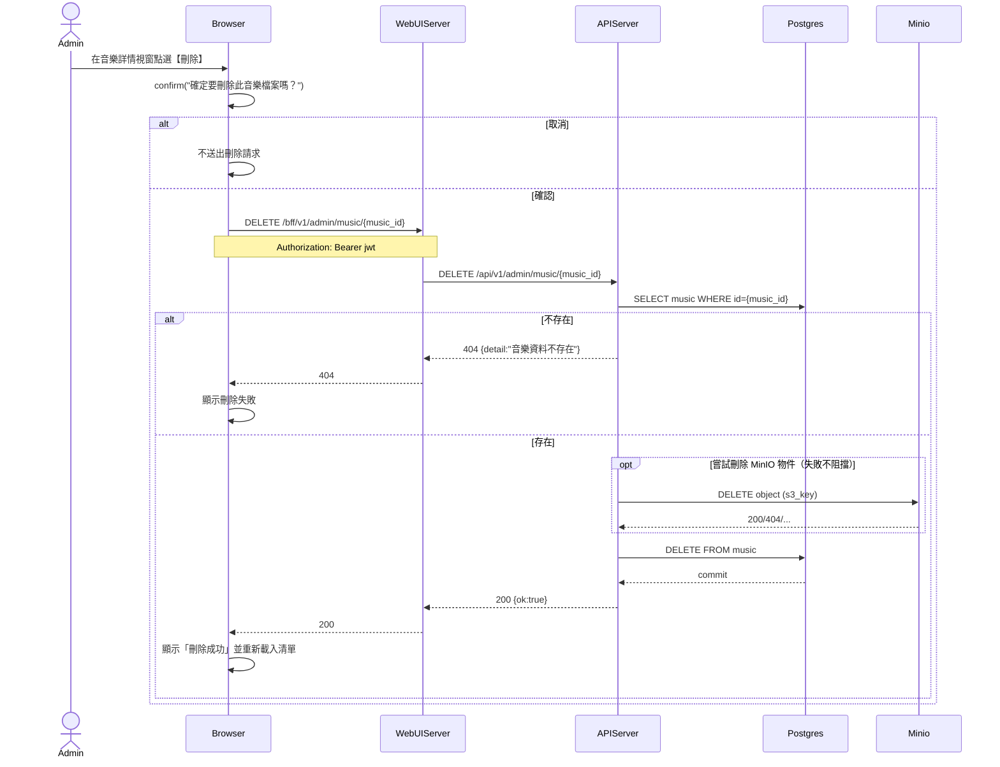

# 3-3-4 刪除音樂

# Mermaid

```mermaid
sequenceDiagram
  actor Admin
  participant Browser
  participant WebUIServer
  participant APIServer
  participant Postgres
  participant Minio

  Admin ->> Browser: 在音樂詳情視窗點選【刪除】
  Browser ->> Browser: confirm("確定要刪除此音樂檔案嗎？")

  alt 取消
    Browser ->> Browser: 不送出刪除請求
  else 確認
    Browser ->> WebUIServer: DELETE /bff/v1/admin/music/{music_id}
    Note over Browser,WebUIServer: Authorization: Bearer jwt
    WebUIServer ->> APIServer: DELETE /api/v1/admin/music/{music_id}

    APIServer ->> Postgres: SELECT music WHERE id={music_id}
    alt 不存在
      APIServer -->> WebUIServer: 404 {detail:"音樂資料不存在"}
      WebUIServer -->> Browser: 404
      Browser ->> Browser: 顯示刪除失敗
    else 存在
      opt 嘗試刪除 MinIO 物件（失敗不阻擋）
        APIServer ->> Minio: DELETE object (s3_key)
        Minio -->> APIServer: 200/404/...
      end

      APIServer ->> Postgres: DELETE FROM music
      Postgres -->> APIServer: commit
      APIServer -->> WebUIServer: 200 {ok:true}
      WebUIServer -->> Browser: 200
      Browser ->> Browser: 顯示「刪除成功」並重新載入清單
    end
  end
```

## Mermaid 備註
- API：`DELETE /bff/v1/admin/music/{music_id}`。
- 後端對 S3 的刪除為 best-effort：刪除失敗仍會刪 DB（但會 log）。
