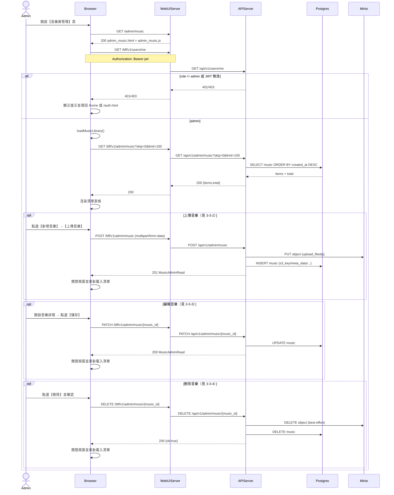

# 3-3 音樂庫管理

# Mermaid

```mermaid
sequenceDiagram
  actor Admin
  participant Browser
  participant WebUIServer
  participant APIServer
  participant Postgres
  participant Minio

  Admin ->> Browser: 開啟【音樂庫管理】頁
  Browser ->> WebUIServer: GET /admin/music
  WebUIServer -->> Browser: 200 admin_music.html + admin_music.js

  Browser ->> WebUIServer: GET /bff/v1/users/me
  Note over Browser,WebUIServer: Authorization: Bearer jwt
  WebUIServer ->> APIServer: GET /api/v1/users/me
  alt role != admin 或 JWT 無效
    APIServer -->> WebUIServer: 401/403
    WebUIServer -->> Browser: 401/403
    Browser ->> Browser: 顯示提示並導回 /home 或 /auth.html
  else admin
    Browser ->> Browser: loadMusicLibrary()
    Browser ->> WebUIServer: GET /bff/v1/admin/music?skip=0&limit=100
    WebUIServer ->> APIServer: GET /api/v1/admin/music?skip=0&limit=100
    APIServer ->> Postgres: SELECT music ORDER BY created_at DESC
    Postgres -->> APIServer: items + total
    APIServer -->> WebUIServer: 200 {items,total}
    WebUIServer -->> Browser: 200
    Browser ->> Browser: 渲染清單表格

    opt 上傳音樂（見 3-3-2）
      Admin ->> Browser: 點選【新增音樂】→【上傳音樂】
      Browser ->> WebUIServer: POST /bff/v1/admin/music (multipart/form-data)
      WebUIServer ->> APIServer: POST /api/v1/admin/music
      APIServer ->> Minio: PUT object (upload_fileobj)
      APIServer ->> Postgres: INSERT music (s3_key/meta_data/...)
      APIServer -->> Browser: 201 MusicAdminRead
      Browser ->> Browser: 關閉視窗並重新載入清單
    end

    opt 編輯音樂（見 3-3-3）
      Admin ->> Browser: 開啟音樂詳情 → 點選【儲存】
      Browser ->> WebUIServer: PATCH /bff/v1/admin/music/{music_id}
      WebUIServer ->> APIServer: PATCH /api/v1/admin/music/{music_id}
      APIServer ->> Postgres: UPDATE music
      APIServer -->> Browser: 200 MusicAdminRead
      Browser ->> Browser: 關閉視窗並重新載入清單
    end

    opt 刪除音樂（見 3-3-4）
      Admin ->> Browser: 點選【刪除】並確認
      Browser ->> WebUIServer: DELETE /bff/v1/admin/music/{music_id}
      WebUIServer ->> APIServer: DELETE /api/v1/admin/music/{music_id}
      APIServer ->> Minio: DELETE object (best-effort)
      APIServer ->> Postgres: DELETE music
      APIServer -->> Browser: 200 {ok:true}
      Browser ->> Browser: 關閉視窗並重新載入清單
    end
  end
```

## Mermaid 備註
- 管理端音樂 API 前綴：`/admin/music`（僅管理員）。
- 檔案儲存：MinIO(S3)；資料：Postgres `music` 表。
- 前端每次上傳/更新/刪除後，都會再呼叫 `loadMusicLibrary()` 重新抓清單。
