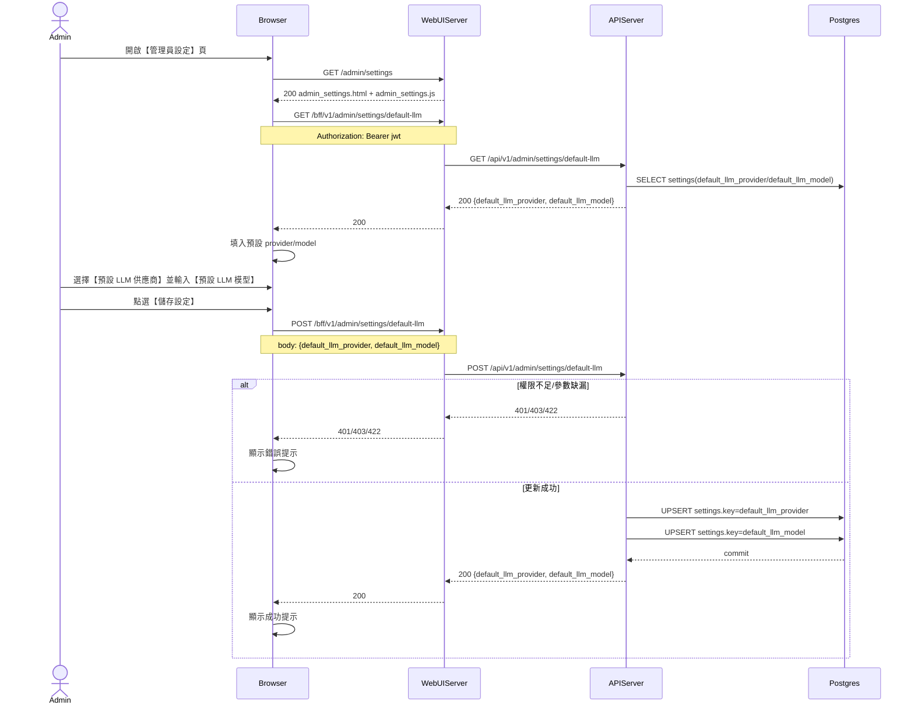

# 3-4-1 系統預設 LLM

# Mermaid

## Mermaid 備註
- API：`GET/POST /bff/v1/admin/settings/default-llm`。
- 寫入位置：`settings` 表的 `default_llm_provider`、`default_llm_model`（value 以 JSON 字串保存）。
- 影響範圍：使用者勾選「使用系統預設 API Key」時，其 Chat 會強制使用此系統預設 provider/model（見 `UserService.get_user_llm_config()`）。
