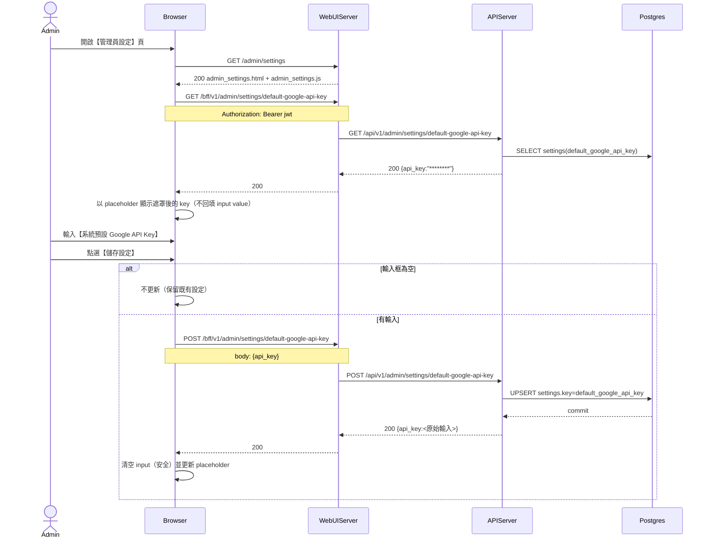

# 3-4-2 系統預設 Google API Key

# Mermaid

## Mermaid 備註
- API：`GET/POST /bff/v1/admin/settings/default-google-api-key`。
- 顯示策略：GET 端點只回傳遮罩後的 key（前 8 + 後 8），避免明碼顯示。
- 寫入位置：`settings.key = default_google_api_key`（value 以 JSON 字串保存：`{"api_key": "..."}`）。
