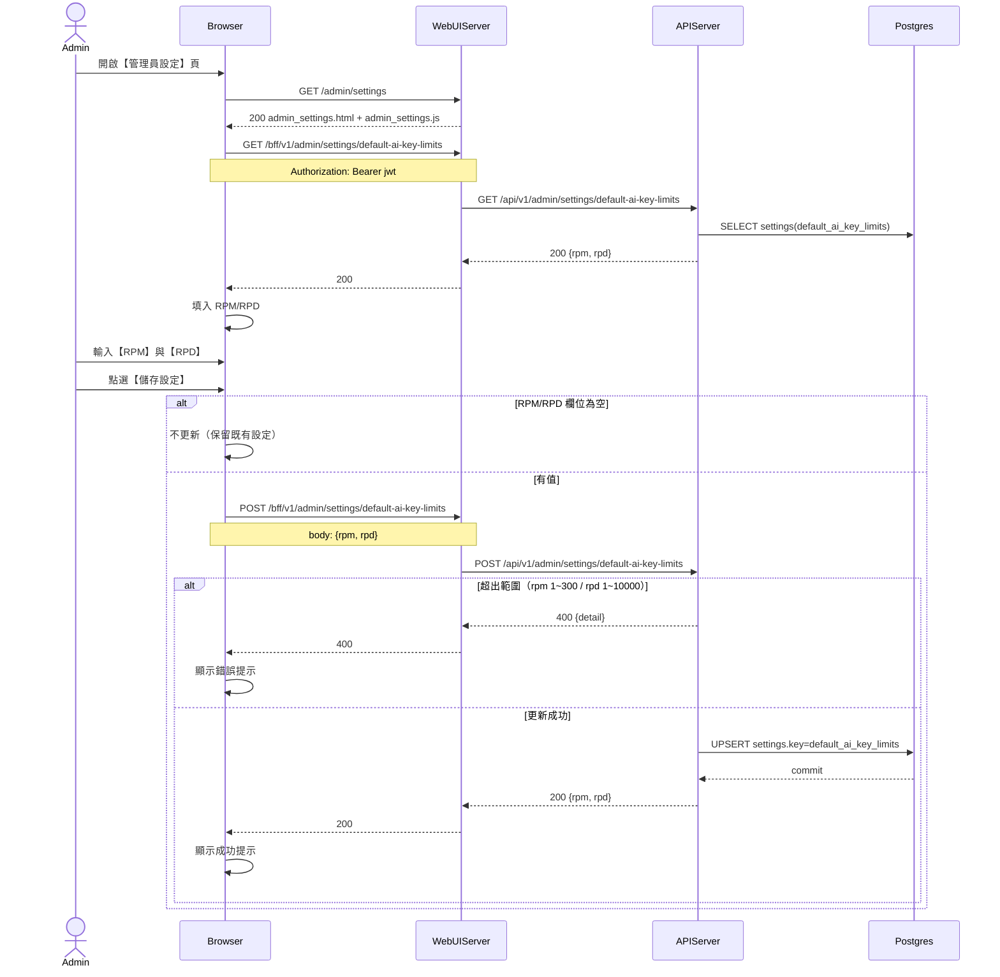

# 3-4-3 預設 AI key 用量限制

# Mermaid

## Mermaid 備註
- API：`GET/POST /bff/v1/admin/settings/default-ai-key-limits`。
- 寫入位置：`settings.key = default_ai_key_limits`（value 為 JSON：`{"rpm":10,"rpd":20}`）。
- 套用時機：只對「使用系統預設 API Key」的使用者套用（Chat 端會用 in-memory rate limiter 檢查）。
