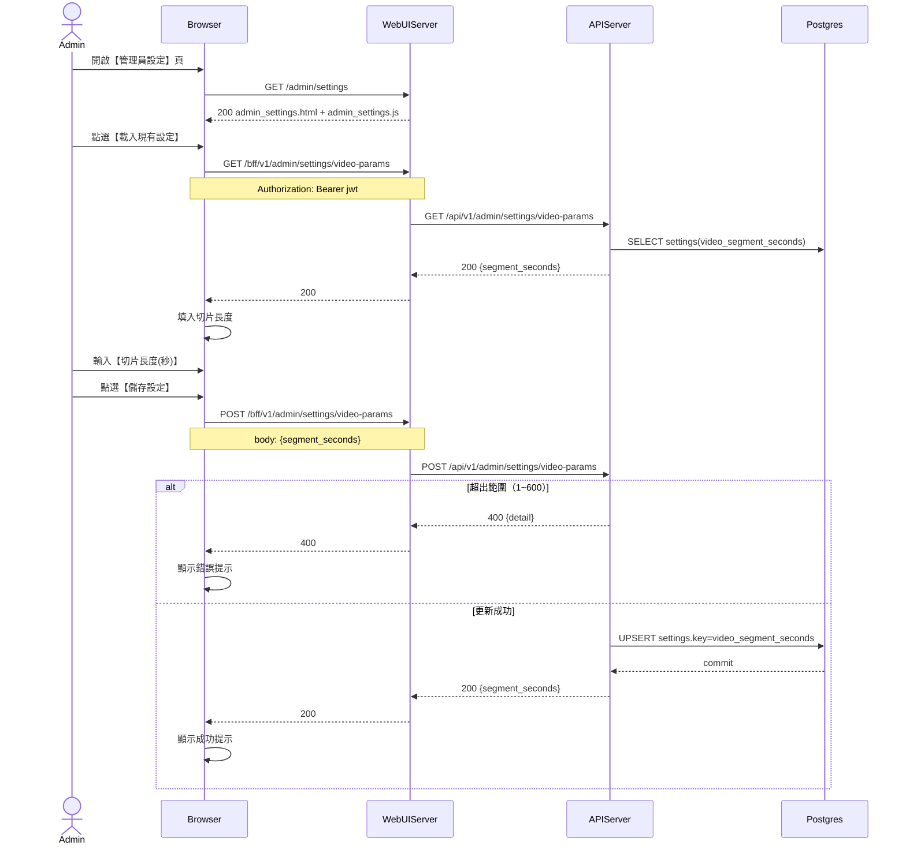

# 3-4-4 影片參數

# Mermaid

## Mermaid 備註
- API：`GET/POST /bff/v1/admin/settings/video-params`。
- 寫入位置：`settings.key = video_segment_seconds`（value 為 JSON：`{"segment_seconds":30}`）。
- 使用位置：Streaming/錄影切片會以此值作為每段影片切片長度。
