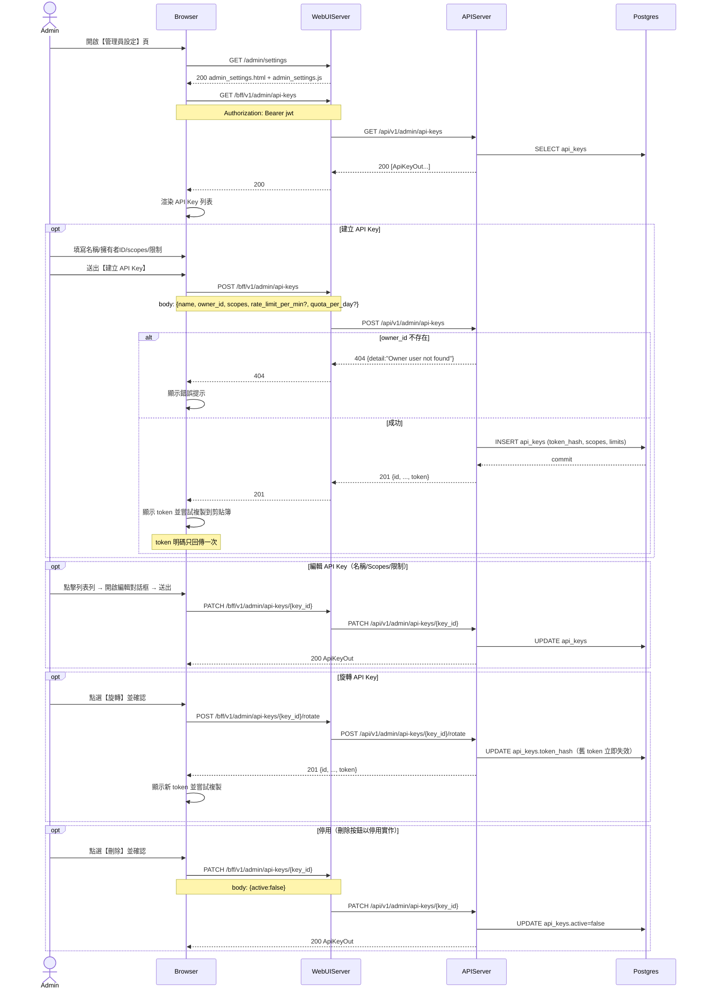

# 3-4-5 M2M API Key 管理

# Mermaid

## Mermaid 備註
- API：
  - 列表：`GET /bff/v1/admin/api-keys`
  - 建立：`POST /bff/v1/admin/api-keys`
  - 更新：`PATCH /bff/v1/admin/api-keys/{key_id}`
  - 旋轉：`POST /bff/v1/admin/api-keys/{key_id}/rotate`
- token 明碼僅在「建立/旋轉」回傳一次；前端會提示並嘗試複製到剪貼簿。
- 前端的【刪除】目前是以 `active=false` 實作停用（後端未提供真正刪除端點）。
