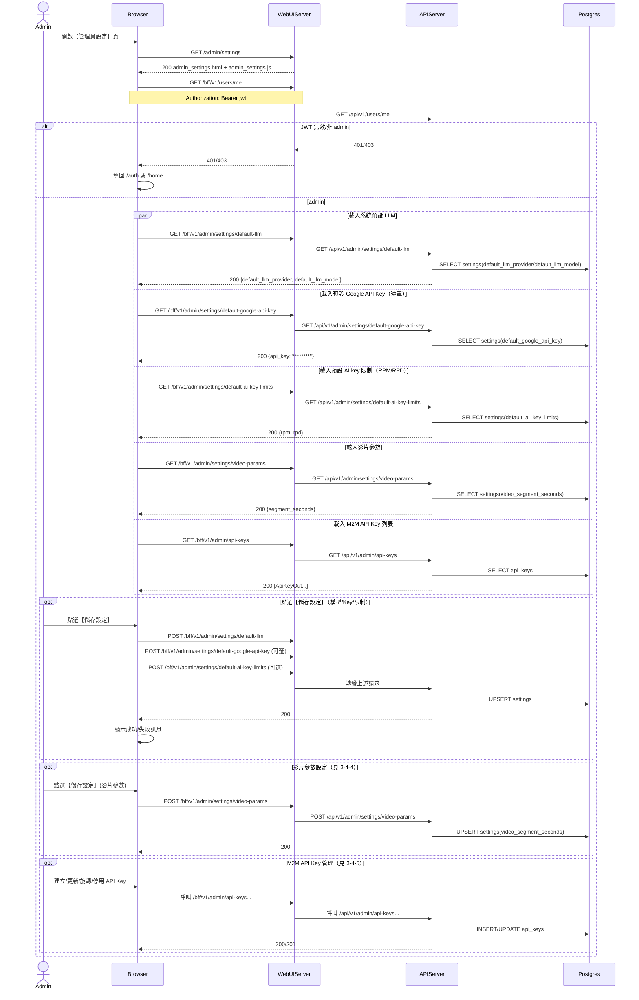

# 3-4 系統設定

# Mermaid

## Mermaid 備註
- 此頁面實作在 `admin_settings.html/js`，會在 `boot()` 時並行載入：預設 LLM、預設 Google API Key（遮罩）、預設 AI key 限制、影片參數、M2M API Key 列表。
- 「儲存設定」按鈕會一次處理：預設 LLM +（若輸入才更新）預設 Google API Key +（若有值才更新）RPM/RPD。
