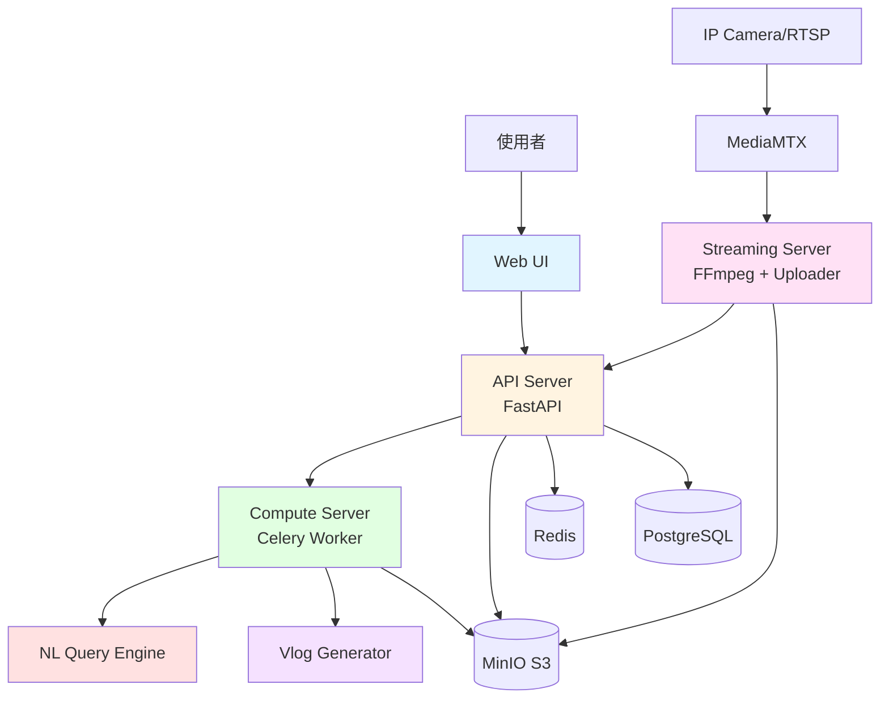
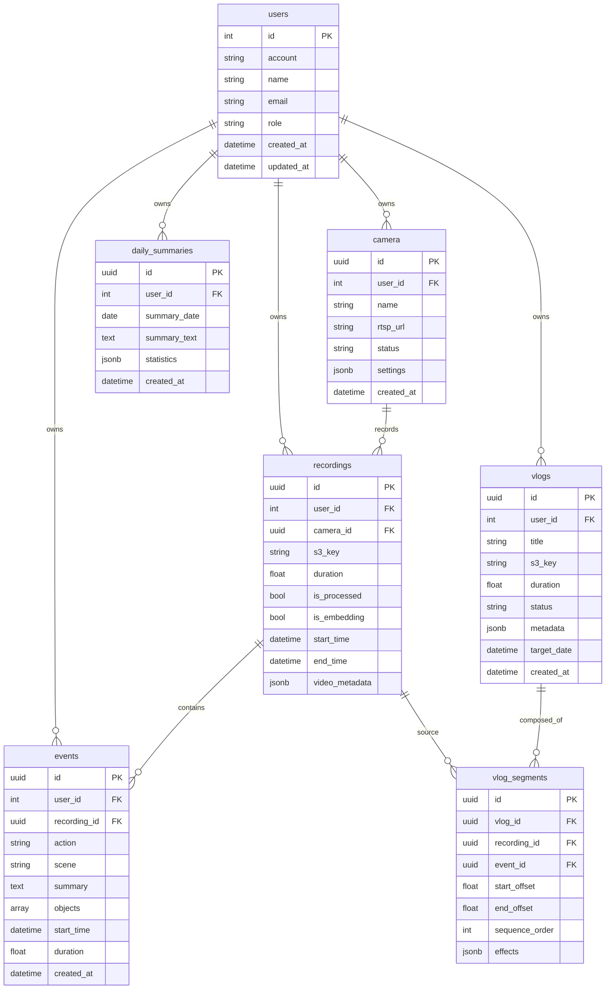
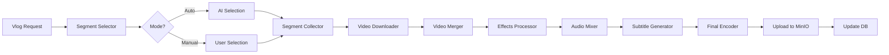
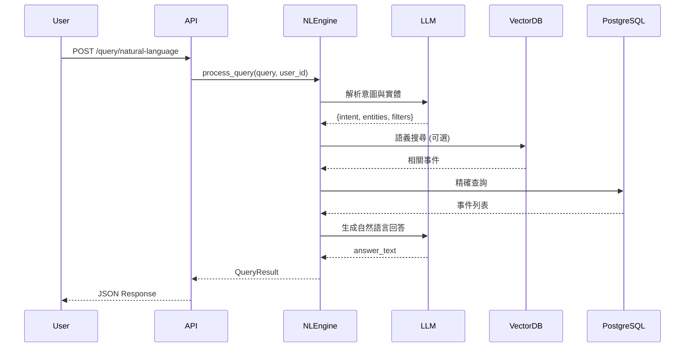

# LifeLog.ai 技術規格文件

## 1. 系統概述

**LifeLog.ai** 是一套以「AI 自動紀錄生活片段並生成個人化日誌與短影片」為核心的智慧系統。系統透過攝影鏡頭自動捕捉日常畫面，利用 AI 進行事件偵測、生成日誌摘要、剪輯精華短片，並支援自然語言查詢。

### 1.1 產品特色

| 功能面 | 說明 |
| --- | --- |
| **自動錄影與事件偵測** | 系統可透過攝影鏡頭（如穿戴式、固定式或 RTSP 串流來源）自動紀錄生活片段，無需手持手機。 |
| **AI 分鏡與事件摘要** | 以 OpenCV / BLIP / Gemini 模型分析影片內容，自動切出具有活動意義的片段（吃飯、出門、遊玩、交談等）。 |
| **AI 文字日誌生成** | 利用自然語言模型自動生成當日生活日誌摘要，記錄「幾點幾分做了什麼」。 |
| **Vlog 自動生成（回憶短片）** | 系統每日自動生成一段 30 秒的「生活精華短片」，可附字幕與背景音樂。 |
| **自然語言影片查詢** | 使用者可透過語音或文字查詢：「我今天幾點在海邊？」→ 系統定位對應片段與時間。 |
| **影片下載與輕量剪輯** | 提供下載回顧短片與簡易編輯功能（裁切、調速、加音樂）。 |
| **雲端媒體管理** | 系統整合 MinIO 進行影片、關鍵幀與日誌的雲端儲存與快取，支援個人帳號存取。 |

### 1.2 專案範圍

| 範圍內 | 範圍外 |
| --- | --- |
| 單一使用者（個人）生活紀錄 | 多人共享或社群平台功能 |
| 單鏡頭來源（可模擬 RTSP） | 多攝影機整合與遠端監控 |
| AI 分鏡與文字摘要 | 高精度行為辨識、醫療用途 |
| 回憶短片自動生成 | 影片長篇剪輯、濾鏡設計 |
| Web 端應用（FastAPI） | 手機 App / 穿戴硬體開發 |
| 個人資料與雲端安全機制 | 醫療資訊安全法規（HIPAA） |

## 2. 系統架構

### 2.1 整體架構圖



### 2.2 微服務架構

#### 2.2.1 APIServer (FastAPI)
- **職責**：主要 API 服務、使用者認證、資料庫操作、任務管理
- **技術棧**：FastAPI, SQLAlchemy, JWT, Pydantic
- **端口**：30000（公開）

#### 2.2.2 StreamingServer (FastAPI)
- **職責**：FFmpeg 進程管理、影片分段錄製、檔案上傳、任務排程
- **技術棧**：FastAPI, FFmpeg, asyncio
- **端口**：30500（公開），內部使用 30500

#### 2.2.3 ComputeServer (Celery)
- **職責**：AI 模型推理、影片分析、事件生成、Vlog 合成
- **技術棧**：Celery, OpenCV, BLIP, Transformers, FFmpeg
- **佇列**：Redis
- **端口**：不公開外網（內部使用，30040 保留）

#### 2.2.4 VlogGenerator (新增模組)
- **職責**：自動生成回憶短片、字幕合成、音樂配樂
- **技術棧**：FFmpeg, MoviePy, Whisper (可選)
- **整合**：ComputeServer 內的子模組

#### 2.2.5 NLQueryEngine (新增模組)
- **職責**：自然語言查詢、語義理解、事件檢索
- **技術棧**：LangChain, Vector DB (可選), LLM API
- **整合**：ComputeServer 或 APIServer

## 3. 資料模型

### 3.1 資料庫 Schema



### 3.2 新增資料表說明

#### vlogs (Vlog 短片)
```sql
CREATE TABLE vlogs (
    id UUID PRIMARY KEY DEFAULT uuid_generate_v7(),
    user_id INTEGER NOT NULL REFERENCES users(id),
    title VARCHAR(255),
    s3_key TEXT NOT NULL,
    duration FLOAT,
    status VARCHAR(50) DEFAULT 'processing', -- processing, completed, failed
    metadata JSONB,
    target_date DATE, -- 目標日期（例如：2025-10-20）
    created_at TIMESTAMP WITH TIME ZONE DEFAULT NOW(),
    updated_at TIMESTAMP WITH TIME ZONE DEFAULT NOW()
);
CREATE INDEX idx_vlogs_user_date ON vlogs(user_id, target_date);
CREATE INDEX idx_vlogs_status ON vlogs(status);
```

#### vlog_segments (Vlog 片段)
```sql
CREATE TABLE vlog_segments (
    id UUID PRIMARY KEY DEFAULT uuid_generate_v7(),
    vlog_id UUID NOT NULL REFERENCES vlogs(id) ON DELETE CASCADE,
    recording_id UUID REFERENCES recordings(id),
    event_id UUID REFERENCES events(id),
    start_offset FLOAT NOT NULL, -- 片段起始時間（秒）
    end_offset FLOAT NOT NULL,   -- 片段結束時間（秒）
    sequence_order INTEGER NOT NULL, -- 在 vlog 中的順序
    effects JSONB, -- 特效設定（轉場、濾鏡等）
    created_at TIMESTAMP WITH TIME ZONE DEFAULT NOW()
);
CREATE INDEX idx_vlog_segments_vlog ON vlog_segments(vlog_id, sequence_order);
```

#### daily_summaries (每日總結)
```sql
CREATE TABLE daily_summaries (
    id UUID PRIMARY KEY DEFAULT uuid_generate_v7(),
    user_id INTEGER NOT NULL REFERENCES users(id),
    summary_date DATE NOT NULL,
    summary_text TEXT, -- AI 生成的日誌摘要
    statistics JSONB, -- 統計資料（事件數量、活動時長等）
    created_at TIMESTAMP WITH TIME ZONE DEFAULT NOW(),
    updated_at TIMESTAMP WITH TIME ZONE DEFAULT NOW(),
    UNIQUE(user_id, summary_date)
);
CREATE INDEX idx_daily_summaries_user_date ON daily_summaries(user_id, summary_date DESC);
```

## 4. API 規格

### 4.1 現有 API (已實作)

參考 `services/README.md` 中的完整 API 概覽。

### 4.2 新增 API 端點

#### 4.2.1 Vlog 管理 API

**POST /api/v1/vlogs**
```json
// Request
{
  "title": "2025年10月20日的美好一天",
  "target_date": "2025-10-20",
  "mode": "auto", // auto: AI選擇, manual: 手動選擇
  "segment_selection": [
    {
      "recording_id": "uuid",
      "event_id": "uuid",
      "start_time": 10.5,
      "end_time": 25.3
    }
  ],
  "settings": {
    "target_duration": 30, // 目標秒數
    "music": "default", // 音樂選擇
    "transitions": "fade", // 轉場效果
    "include_subtitles": true
  }
}

// Response
{
  "vlog_id": "uuid",
  "status": "processing",
  "estimated_time": 60,
  "message": "Vlog 生成任務已建立"
}
```

**GET /api/v1/vlogs**
```json
// Query Parameters
// ?user_id=1&page=1&size=20&status=completed&date_from=2025-10-01&date_to=2025-10-31

// Response
{
  "items": [
    {
      "id": "uuid",
      "title": "2025年10月20日的美好一天",
      "target_date": "2025-10-20",
      "duration": 30.5,
      "status": "completed",
      "thumbnail_url": "https://...",
      "download_url": "https://...",
      "created_at": "2025-10-20T10:30:00Z"
    }
  ],
  "total": 15,
  "page": 1,
  "size": 20
}
```

**GET /api/v1/vlogs/{vlog_id}**
```json
// Response
{
  "id": "uuid",
  "title": "2025年10月20日的美好一天",
  "target_date": "2025-10-20",
  "duration": 30.5,
  "status": "completed",
  "s3_key": "vlogs/user_1/2025-10-20.mp4",
  "download_url": "https://minio.../presigned_url",
  "segments": [
    {
      "id": "uuid",
      "recording_id": "uuid",
      "event_id": "uuid",
      "start_offset": 0,
      "end_offset": 10.2,
      "sequence_order": 1
    }
  ],
  "metadata": {
    "total_segments": 3,
    "music": "default",
    "transitions": "fade"
  },
  "created_at": "2025-10-20T10:30:00Z"
}
```

**DELETE /api/v1/vlogs/{vlog_id}**
```json
// Response
{
  "ok": true,
  "message": "Vlog 已刪除"
}
```

#### 4.2.2 每日總結 API

**POST /api/v1/daily-summaries/generate**
```json
// Request
{
  "user_id": 1,
  "target_date": "2025-10-20"
}

// Response
{
  "summary_id": "uuid",
  "status": "processing",
  "message": "日誌生成中"
}
```

**GET /api/v1/daily-summaries**
```json
// Query Parameters
// ?user_id=1&date_from=2025-10-01&date_to=2025-10-31&page=1&size=20

// Response
{
  "items": [
    {
      "id": "uuid",
      "summary_date": "2025-10-20",
      "summary_text": "今天早上8點在廚房吃早餐，9點出門到公園散步，中午12點在餐廳用餐...",
      "statistics": {
        "total_events": 12,
        "active_hours": 8.5,
        "scenes": {
          "廚房": 3,
          "客廳": 5,
          "室外": 4
        },
        "actions": {
          "吃飯": 3,
          "散步": 2,
          "閱讀": 1
        }
      },
      "created_at": "2025-10-20T23:00:00Z"
    }
  ],
  "total": 30,
  "page": 1,
  "size": 20
}
```

**GET /api/v1/daily-summaries/{date}**
```json
// Response
{
  "id": "uuid",
  "user_id": 1,
  "summary_date": "2025-10-20",
  "summary_text": "今天早上8點在廚房吃早餐...",
  "statistics": { /* 詳細統計 */ },
  "events": [
    {
      "time": "08:00",
      "action": "吃早餐",
      "scene": "廚房",
      "duration": 15
    }
  ],
  "created_at": "2025-10-20T23:00:00Z"
}
```

#### 4.2.3 自然語言查詢 API

**POST /api/v1/query/natural-language**
```json
// Request
{
  "user_id": 1,
  "query": "我今天幾點在海邊？",
  "context": {
    "date_range": {
      "from": "2025-10-20",
      "to": "2025-10-20"
    }
  }
}

// Response
{
  "query": "我今天幾點在海邊？",
  "interpretation": {
    "intent": "location_time_query",
    "entities": {
      "location": "海邊",
      "time": "今天"
    }
  },
  "results": [
    {
      "event_id": "uuid",
      "recording_id": "uuid",
      "start_time": "2025-10-20T14:30:00Z",
      "end_time": "2025-10-20T15:45:00Z",
      "summary": "在海邊散步並拍照",
      "scene": "室外",
      "confidence": 0.95,
      "video_url": "https://..."
    }
  ],
  "answer": "根據記錄，您今天下午2點30分到3點45分在海邊活動。"
}
```

**GET /api/v1/query/suggestions**
```json
// Query Parameters
// ?user_id=1&date=2025-10-20

// Response
{
  "suggestions": [
    "我今天幾點吃早餐？",
    "今天去了哪些地方？",
    "今天做了什麼活動？",
    "我今天在客廳待了多久？"
  ]
}
```

## 5. 核心模組設計

### 5.1 Vlog Generator (影片合成引擎)

#### 5.1.1 模組架構



#### 5.1.2 AI 片段選擇策略

```python
class VlogSegmentSelector:
    """
    AI 自動選擇精華片段
    """
    def select_highlights(self, events: List[Event], target_duration: int) -> List[Segment]:
        """
        選擇策略：
        1. 優先選擇多樣化場景（避免重複）
        2. 優先選擇顯著動作（吃飯、出門、活動）
        3. 考慮時間分布（早中晚均勻）
        4. 避免模糊或靜態畫面
        5. 總時長控制在目標秒數
        """
        scored_events = []
        for event in events:
            score = self._calculate_score(event)
            scored_events.append((event, score))
        
        # 排序並選擇
        sorted_events = sorted(scored_events, key=lambda x: x[1], reverse=True)
        
        # 動態規劃選擇最佳組合
        selected = self._optimize_selection(sorted_events, target_duration)
        return selected
    
    def _calculate_score(self, event: Event) -> float:
        """計算事件分數"""
        score = 0.0
        
        # 場景多樣性 (10分)
        scene_diversity = self._scene_diversity_score(event.scene)
        score += scene_diversity * 10
        
        # 動作顯著性 (15分)
        action_significance = self._action_significance_score(event.action)
        score += action_significance * 15
        
        # 時長適當性 (5分)
        duration_score = self._duration_score(event.duration)
        score += duration_score * 5
        
        # 畫面品質 (10分)
        if hasattr(event, 'quality_metrics'):
            quality = event.quality_metrics.get('blur_score', 0.5)
            score += (1 - quality) * 10
        
        return score
```

#### 5.1.3 影片合成流程

```python
class VlogGenerator:
    """
    Vlog 影片合成引擎
    """
    
    async def generate_vlog(self, vlog_request: VlogRequest) -> VlogResult:
        """
        完整的 Vlog 生成流程
        """
        try:
            # 1. 選擇片段
            segments = await self._select_segments(vlog_request)
            
            # 2. 下載影片片段
            video_files = await self._download_segments(segments)
            
            # 3. 剪輯與合併
            merged_video = await self._merge_videos(video_files, vlog_request.settings)
            
            # 4. 添加轉場效果
            if vlog_request.settings.transitions:
                merged_video = await self._add_transitions(merged_video)
            
            # 5. 添加音樂
            if vlog_request.settings.music:
                merged_video = await self._add_music(merged_video)
            
            # 6. 生成字幕
            if vlog_request.settings.include_subtitles:
                merged_video = await self._add_subtitles(merged_video, segments)
            
            # 7. 最終編碼
            final_video = await self._encode_final(merged_video)
            
            # 8. 上傳到 MinIO
            s3_key = await self._upload_to_minio(final_video)
            
            # 9. 更新資料庫
            vlog = await self._save_to_db(vlog_request, s3_key, segments)
            
            return VlogResult(success=True, vlog=vlog)
            
        except Exception as e:
            logger.error(f"Vlog generation failed: {e}")
            return VlogResult(success=False, error=str(e))
    
    async def _merge_videos(self, video_files: List[str], settings: dict) -> str:
        """
        使用 FFmpeg 合併影片
        """
        concat_file = self._create_concat_file(video_files)
        output_file = f"/tmp/vlog_{uuid.uuid4()}.mp4"
        
        cmd = [
            "ffmpeg",
            "-f", "concat",
            "-safe", "0",
            "-i", concat_file,
            "-c:v", "libx264",
            "-preset", "medium",
            "-crf", "23",
            "-c:a", "aac",
            "-b:a", "128k",
            output_file
        ]
        
        await self._run_ffmpeg(cmd)
        return output_file
    
    async def _add_music(self, video_file: str, music_key: str = "default") -> str:
        """
        添加背景音樂
        """
        music_file = await self._get_music_file(music_key)
        output_file = f"/tmp/vlog_music_{uuid.uuid4()}.mp4"
        
        cmd = [
            "ffmpeg",
            "-i", video_file,
            "-i", music_file,
            "-filter_complex",
            "[1:a]volume=0.3[music];[0:a][music]amix=inputs=2:duration=shortest",
            "-c:v", "copy",
            "-c:a", "aac",
            output_file
        ]
        
        await self._run_ffmpeg(cmd)
        return output_file
```

### 5.2 Natural Language Query Engine (自然語言查詢引擎)

#### 5.2.1 查詢流程



#### 5.2.2 查詢引擎實作

```python
class NaturalLanguageQueryEngine:
    """
    自然語言查詢引擎
    """
    
    def __init__(self, llm_client, db_session):
        self.llm = llm_client
        self.db = db_session
        self.intent_classifier = IntentClassifier()
    
    async def process_query(self, query: str, user_id: int, context: dict) -> QueryResult:
        """
        處理自然語言查詢
        """
        # 1. 意圖識別與實體抽取
        interpretation = await self._parse_query(query, context)
        
        # 2. 構建資料庫查詢
        db_filters = self._build_filters(interpretation, user_id)
        
        # 3. 執行查詢
        events = await self._search_events(db_filters)
        
        # 4. 生成自然語言回答
        answer = await self._generate_answer(query, events, interpretation)
        
        return QueryResult(
            query=query,
            interpretation=interpretation,
            results=events,
            answer=answer
        )
    
    async def _parse_query(self, query: str, context: dict) -> dict:
        """
        使用 LLM 解析查詢意圖
        """
        prompt = f"""
解析以下自然語言查詢，提取關鍵資訊：

查詢："{query}"
上下文：{json.dumps(context, ensure_ascii=False)}

請以 JSON 格式回答，包含：
1. intent: 查詢意圖（time_query, location_query, activity_query, duration_query 等）
2. entities: 實體（時間、地點、動作、場景等）
3. filters: 資料庫查詢條件

範例輸出：
{{
  "intent": "location_time_query",
  "entities": {{
    "location": "海邊",
    "time": "今天",
    "date": "2025-10-20"
  }},
  "filters": {{
    "scene_keywords": ["室外", "海邊"],
    "date_range": {{"from": "2025-10-20", "to": "2025-10-20"}}
  }}
}}
"""
        
        response = await self.llm.invoke(prompt)
        return self._clean_llm_output(response)
    
    def _build_filters(self, interpretation: dict, user_id: int) -> dict:
        """
        根據解析結果構建資料庫查詢條件
        """
        filters = {"user_id": user_id}
        
        entities = interpretation.get("entities", {})
        llm_filters = interpretation.get("filters", {})
        
        # 時間範圍
        if "date_range" in llm_filters:
            filters["start_time__gte"] = llm_filters["date_range"]["from"]
            filters["start_time__lte"] = llm_filters["date_range"]["to"]
        
        # 場景關鍵字
        if "scene_keywords" in llm_filters:
            filters["scene__in"] = llm_filters["scene_keywords"]
        
        # 動作關鍵字
        if "action_keywords" in llm_filters:
            filters["action__in"] = llm_filters["action_keywords"]
        
        # 物件搜尋
        if "objects" in llm_filters:
            filters["objects__overlap"] = llm_filters["objects"]
        
        return filters
    
    async def _search_events(self, filters: dict) -> List[Event]:
        """
        執行資料庫查詢
        """
        query = self.db.query(EventsTable).filter_by(user_id=filters["user_id"])
        
        if "start_time__gte" in filters:
            query = query.filter(EventsTable.start_time >= filters["start_time__gte"])
        
        if "start_time__lte" in filters:
            query = query.filter(EventsTable.start_time <= filters["start_time__lte"])
        
        if "scene__in" in filters:
            query = query.filter(EventsTable.scene.in_(filters["scene__in"]))
        
        if "action__in" in filters:
            query = query.filter(EventsTable.action.in_(filters["action__in"]))
        
        events = query.order_by(EventsTable.start_time).all()
        return events
    
    async def _generate_answer(self, query: str, events: List[Event], interpretation: dict) -> str:
        """
        生成自然語言回答
        """
        if not events:
            return "抱歉，沒有找到相關的活動記錄。"
        
        events_summary = "\n".join([
            f"- {e.start_time.strftime('%H:%M')}: {e.summary} (地點: {e.scene})"
            for e in events
        ])
        
        prompt = f"""
根據以下查詢和搜尋結果，生成自然且友善的回答：

使用者查詢："{query}"
搜尋結果：
{events_summary}

請用繁體中文回答，語氣親切自然。
"""
        
        answer = await self.llm.invoke(prompt)
        return answer.strip()
```

### 5.3 Daily Summary Generator (每日總結生成器)

```python
class DailySummaryGenerator:
    """
    每日生活日誌生成器
    """
    
    async def generate_daily_summary(self, user_id: int, target_date: date) -> DailySummary:
        """
        生成指定日期的每日總結
        """
        # 1. 取得當日所有事件
        events = await self._get_events_by_date(user_id, target_date)
        
        if not events:
            return DailySummary(
                user_id=user_id,
                summary_date=target_date,
                summary_text="今天沒有記錄到任何活動。",
                statistics={}
            )
        
        # 2. 統計資料
        statistics = self._calculate_statistics(events)
        
        # 3. 生成摘要文字
        summary_text = await self._generate_summary_text(events, statistics)
        
        # 4. 儲存到資料庫
        summary = await self._save_summary(user_id, target_date, summary_text, statistics)
        
        return summary
    
    def _calculate_statistics(self, events: List[Event]) -> dict:
        """
        計算統計資料
        """
        scenes = {}
        actions = {}
        total_duration = 0
        
        for event in events:
            # 場景統計
            if event.scene:
                scenes[event.scene] = scenes.get(event.scene, 0) + 1
            
            # 動作統計
            if event.action:
                actions[event.action] = actions.get(event.action, 0) + 1
            
            # 總時長
            if event.duration:
                total_duration += event.duration
        
        return {
            "total_events": len(events),
            "active_hours": total_duration / 3600,
            "scenes": scenes,
            "actions": actions,
            "first_activity": events[0].start_time.strftime("%H:%M") if events else None,
            "last_activity": events[-1].start_time.strftime("%H:%M") if events else None
        }
    
    async def _generate_summary_text(self, events: List[Event], statistics: dict) -> str:
        """
        使用 LLM 生成流暢的日誌摘要
        """
        events_list = [
            {
                "time": e.start_time.strftime("%H:%M"),
                "action": e.action,
                "scene": e.scene,
                "summary": e.summary
            }
            for e in events
        ]
        
        prompt = f"""
請根據以下活動記錄，生成一篇流暢的生活日誌摘要：

統計資料：
- 總事件數：{statistics['total_events']}
- 活動時長：{statistics['active_hours']:.1f} 小時
- 第一個活動：{statistics['first_activity']}
- 最後一個活動：{statistics['last_activity']}

詳細活動：
{json.dumps(events_list, ensure_ascii=False, indent=2)}

請用繁體中文撰寫，語氣溫暖親切，像是在寫日記。
摘要應該包含：
1. 一天的整體概況
2. 主要活動與時間
3. 活動場所
4. 簡短的總結或感想

範例格式：
今天早上8點在廚房吃早餐，享受了一頓豐盛的早餐時光。上午9點出門到公園散步，呼吸新鮮空氣。中午12點在餐廳用餐...
"""
        
        summary = await self.llm.invoke(prompt)
        return summary.strip()
```

## 6. 任務佇列設計

### 6.1 Celery 任務定義

```python
# services/ComputeServer/app/tasks/vlog_processing.py

@app.task(name="tasks.generate_vlog", bind=True)
def generate_vlog(self, vlog_request: dict):
    """
    Vlog 生成任務
    """
    generator = VlogGenerator()
    result = generator.generate_vlog(vlog_request)
    
    # 回報結果
    response = requests.post(
        f"{API_SERVER_URL}/vlogs/{vlog_request['vlog_id']}/complete",
        headers=headers,
        json=result,
        timeout=30
    )
    return response.json()

@app.task(name="tasks.generate_daily_summary", bind=True)
def generate_daily_summary(self, request: dict):
    """
    每日總結生成任務
    """
    generator = DailySummaryGenerator()
    summary = generator.generate_daily_summary(
        user_id=request['user_id'],
        target_date=request['target_date']
    )
    
    # 儲存結果
    response = requests.post(
        f"{API_SERVER_URL}/daily-summaries/{request['summary_id']}/complete",
        headers=headers,
        json=summary,
        timeout=30
    )
    return response.json()
```

## 7. 前端設計

### 7.1 頁面結構

```
Web UI
├── 登入/註冊頁面
├── 儀表板 (Dashboard)
│   ├── 今日活動總覽
│   ├── 最新錄影
│   └── 最新 Vlog
├── 攝影機管理
│   ├── 攝影機列表
│   ├── 新增攝影機
│   └── 串流測試
├── 錄影與事件
│   ├── 錄影列表（時間軸）
│   ├── 事件列表
│   └── 影片播放器
├── Vlog 管理
│   ├── Vlog 列表
│   ├── 建立 Vlog（AI/手動）
│   └── Vlog 播放與下載
├── 每日日誌
│   ├── 日曆檢視
│   ├── 日誌詳情
│   └── 統計圖表
└── 自然語言查詢
    ├── 查詢介面
    ├── 查詢建議
    └── 結果展示
```

### 7.2 關鍵頁面 Wireframe

#### 7.2.1 Vlog 建立頁面

```
┌─────────────────────────────────────────────────────┐
│  建立回憶短片                                  [X]   │
├─────────────────────────────────────────────────────┤
│                                                      │
│  日期選擇: [2025-10-20 ▼]                          │
│                                                      │
│  片段選擇模式:                                       │
│    ○ AI 自動選擇    ● 手動選擇                      │
│                                                      │
│  ┌────────────────────────────────────────────┐   │
│  │  可用片段 (共 12 段)               [全選]    │   │
│  ├────────────────────────────────────────────┤   │
│  │ ☑ 08:15 - 08:30  在廚房吃早餐      [預覽]  │   │
│  │ ☑ 09:00 - 09:45  在公園散步        [預覽]  │   │
│  │ ☐ 12:00 - 12:30  在餐廳用餐        [預覽]  │   │
│  │ ...                                         │   │
│  └────────────────────────────────────────────┘   │
│                                                      │
│  Vlog 設定:                                          │
│    目標時長: [30] 秒                                │
│    背景音樂: [輕快的一天 ▼]                         │
│    轉場效果: [淡入淡出 ▼]                           │
│    ☑ 包含字幕                                       │
│                                                      │
│  [取消]                           [開始生成 Vlog]   │
└─────────────────────────────────────────────────────┘
```

#### 7.2.2 自然語言查詢頁面

```
┌─────────────────────────────────────────────────────┐
│  智慧搜尋                                            │
├─────────────────────────────────────────────────────┤
│                                                      │
│  ┌──────────────────────────────────────────────┐  │
│  │ 我今天幾點在海邊？                     [搜尋] │  │
│  └──────────────────────────────────────────────┘  │
│                                                      │
│  建議查詢:                                           │
│    • 我今天幾點吃早餐？                             │
│    • 今天去了哪些地方？                             │
│    • 今天在客廳待了多久？                           │
│                                                      │
│  搜尋結果:                                           │
│  ┌────────────────────────────────────────────┐   │
│  │ 根據記錄，您今天下午 2:30 到 3:45 在海邊活動。│   │
│  └────────────────────────────────────────────┘   │
│                                                      │
│  相關片段:                                           │
│  ┌────────────────────────────────────────────┐   │
│  │ 📹 14:30 - 15:45  在海邊散步並拍照          │   │
│  │    地點: 室外 | 置信度: 95%      [觀看影片]  │   │
│  └────────────────────────────────────────────┘   │
│                                                      │
└─────────────────────────────────────────────────────┘
```

## 8. 部署架構

### 8.1 Docker Compose 服務清單

```yaml
services:
  postgres:      # PostgreSQL 資料庫
  redis:         # Redis 快取與任務佇列
  minio:         # MinIO 物件儲存
  mediamtx:      # RTSP 串流路由器
  api:           # API Server (FastAPI)
  compute:       # Compute Server (Celery)
  streaming:     # Streaming Server (FastAPI)
  webui:         # Web UI Server (新增)
```

### 8.1.1 服務端口配置

| 服務名稱 | 外部端口 | 內部端口 | 說明 |
| --- | --- | --- | --- |
| **API Server** | 30000 | 30000 | 主要 API 服務 |
| **WebUI Server** | 30100 | 30100 | Web 前端服務 |
| **MediaMTX** | | | |
| └─ RTSP | 30201 | 8554 | RTSP 串流協議 |
| └─ HLS | 30202 | 8888 | HLS 串流協議 |
| └─ WebRTC | 30204 | 8889 | WebRTC 串流協議 |
| **MinIO** | | | |
| └─ API | 30300 | 9000 | MinIO API 端點 |
| └─ Console | 30301 | 9001 | MinIO 管理介面 |
| **Compute Server** | - | - | 不公開外網（內部使用，30040 保留） |
| **Streaming Server** | 30500 | 30500 | 串流錄製服務 |
| **Redis** | 30600 | 6379 | 快取與任務佇列（內部使用） |
| **PostgreSQL** | 30700 | 5432 | 資料庫服務（內部使用） |

**注意事項**:
- 所有服務均在 Docker 內部網絡 `demo-network` 中通信
- 外部端口映射僅用於開發和測試環境
- 生產環境建議使用反向代理（如 Nginx）統一管理端口

### 8.2 環境變數配置

參考現有 `.env` 檔案，新增：

```bash
# Vlog 生成設定
VLOG_DEFAULT_DURATION=30
VLOG_DEFAULT_MUSIC=default
VLOG_TEMP_DIR=/tmp/vlog_processing

# LLM 設定 (用於自然語言查詢)
GOOGLE_API_KEY=your_google_api_key
LLM_MODEL=gemini-2.0-flash
LLM_TEMPERATURE=0.7

# 每日總結設定
DAILY_SUMMARY_AUTO_GENERATE=true
DAILY_SUMMARY_TIME=23:00
```

## 9. 效能指標

| 指標 | 目標值 | 測量方法 |
| --- | --- | --- |
| API 回應時間 | < 2 秒 | 95th percentile |
| 影片處理成功率 | ≥ 95% | 成功任務 / 總任務 |
| Vlog 生成時間 | < 60 秒 (30秒片段) | 平均處理時間 |
| 查詢準確率 | ≥ 85% | 人工評估 |
| 系統可用性 | ≥ 99% | Uptime monitoring |
| 日誌完整性 | 100% | 所有操作有日誌 |

## 10. 安全性設計

### 10.1 認證與授權

- **JWT Token**：有效期 1 小時，支援 refresh token
- **API Key**：支援多種 scope（uploader, compute, admin 等）
- **CORS**：限制來源網域
- **Rate Limiting**：防止 API 濫用

### 10.2 資料安全

- **MinIO 加密**：傳輸層 TLS，可選儲存層加密
- **密碼雜湊**：bcrypt with salt
- **敏感資料遮罩**：日誌中不顯示密碼、token
- **資料隔離**：使用者資料完全隔離

## 11. 監控與日誌

### 11.1 日誌策略

- **結構化日誌**：JSON 格式，包含 trace_id
- **日誌層級**：DEBUG, INFO, WARNING, ERROR, CRITICAL
- **日誌輪轉**：每日輪轉，保留 30 天
- **集中管理**：可選 Fluent-bit 收集

### 11.2 監控指標

- **系統指標**：CPU、記憶體、磁碟使用率
- **服務指標**：請求數、錯誤率、延遲
- **業務指標**：影片處理數、Vlog 生成數、查詢數
- **健康檢查**：所有服務提供 `/healthz` 端點

## 12. 測試策略

### 12.1 單元測試

- API 端點測試
- 資料模型驗證
- 業務邏輯測試
- 覆蓋率目標：≥ 70%

### 12.2 整合測試

- 服務間通訊測試
- 資料庫操作測試
- MinIO 上傳下載測試
- Celery 任務執行測試

### 12.3 端到端測試

- 完整流程測試（錄影 → 分析 → Vlog → 查詢）
- Demo 場景模擬
- 壓力測試

## 13. 未來擴充方向

| 功能 | 優先級 | 說明 |
| --- | --- | --- |
| 多攝影機支援 | 中 | 支援多個 RTSP 來源整合 |
| 社群分享功能 | 低 | Vlog 分享到社群平台 |
| 進階影片編輯 | 中 | 更多濾鏡、特效、轉場 |
| 語音查詢 | 高 | 整合語音辨識 (Whisper) |
| 行動 App | 低 | iOS/Android 應用 |
| Vector Database | 高 | 更精確的語義搜尋 |
| 即時提醒 | 中 | 異常行為即時通知 |
| 多語言支援 | 低 | 英文、日文等 |

---

**文件版本**: v1.0  
**最後更新**: 2025-10-20  
**維護者**: LifeLog.ai 開發團隊
